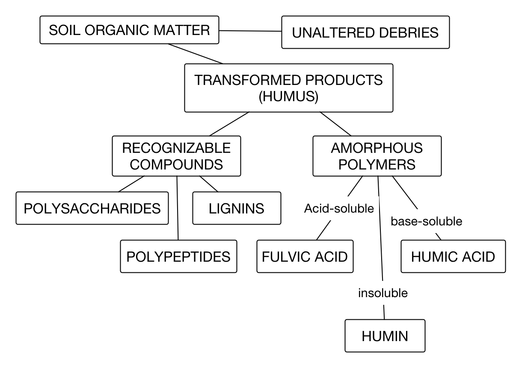

## Soil Biology

Separating the physical soil properties from biologically mediated properties—at
	times—helps understanding of the biologicals themselves, and the soil.

### Ecosystem, Ecology, Ecosystem Services, Biogeochemistry, and Geochemistry

An introductory survey of Soil—as a medium for sustaining biologicals—is a noble cause.
	This section first has some information about ecology since the spotlight often
	shines on the lead character, and many consider what soil brings to biologicals to
	be the their interest. The Ecology presented in this reader is not in any way a
	deep dive. Rather, it is a comparison to Ecosystem and Biogeochemistry with the
	goal of grounding the learner. The [Ecology](ecology) portal.

The [Organisms portal](organisms) brings an appreciation for the fact that soil is the
	most diverse Ecosystem on Earth.

The organisms themselves not only channel energy, but they leave behind energetic [soil
	organic matter (SOM)](soil organic matter) utilized by still more organisms. Indeed
	if it were not for decomposing heterotrophs we would be covered up in biological
	waste.
  
### Ecosystem, Ecology, Biogeochemistry, and Ecosystem Ecology

The discussion of soil solids and pores includes information that is fundamental to understanding soils many roles. Soil might be described and considered passive when used as a <u>noun</u>, such as when it is considered an <em>environment</em> either as habitat or setting.

<dl><dt>Environment</dt>
  <dd>The physical and biological factors along with their chemical interactions that affect an <b>organism</b> or a <b>group of organisms</b>.</dd>
  <dd>A biophysical environment can vary in scale from microscopic to global in extent.
  <dd>The number of biophysical environments is countless, given that each living organism has its own environment.</dd>
</dl>

<dl><dt>Ecology</dt><dd>a sub-discipline of biology—often confused with the environment—which studies the interactions among organisms and their environment.</dd></dl>

<dl><dt>System</dt><dd>A cohesive conglomeration of interrelated and interdependent parts that is either natural or man-made. Every system is <b>delineated by its spatial and temporal boundaries</b>, surrounded and influenced by its environment, described by its structure and purpose, or nature, and expressed in its functioning.</dd></dl>

<dl><dt>Systems Ecology</dt><dd>An interdisciplinary field of ecology, a subset of Earth system science, that takes a holistic approach to the study of ecological systems, especially ecosystems.</dd></dl>

 <dl><dt>Ecosystems</dt><dd>Dynamically interacting systems of organisms, the communities they make up, and the non-living components of their environment.</dd></dl>

Soil may also be used as a noun as an <em>ecosystem</em>, which invokes soils truer nature, as a system who&#8217;s sum of interactions are greatly influenced by biological organisms

Ecosystem processes, such as primary production, pedogenesis, nutrient cycling, and niche construction, regulate the flux of energy and matter through an environment.
 

<dl><dt>Biogeochemistry</dt>
  <dd>The scientific discipline that involves the study of the chemical, physical, geological, and biological processes and reactions that govern the composition of the natural environment (including the biosphere, the cryosphere, the hydrosphere, the pedosphere, the atmosphere, and the lithosphere).</dd>
  <dd>In particular, biogeochemistry is the study of the cycles of chemical elements, such as carbon and nitrogen, and their interactions with and incorporation into living things transported through <b>earth scale biological systems</b> in space through time.</dd>
  <dd>The field focuses on chemical cycles which are either driven by or influence biological activity.</dd>
  <dd>Particular emphasis is placed on the study of carbon, nitrogen, sulfur, and phosphorus cycles.</dd>
  <dd>Biogeochemistry is a systems science closely related to systems ecology.</dd>
</dl>

Note that in the definition of Biogeochemistry is the concept of spheres.

<dl><dt>Biosphere</dt><dd>The worldwide sum of all ecosystems.</dd>
  <dd>It can also be termed the zone of life on Earth.</dd></dl>

<dl><dt>Cryosphere</dt><dd>An all-encompassing term for those portions of Earth's surface where water is in solid form, including sea ice, lake ice, river ice, snow cover, glaciers, ice caps, ice sheets, and frozen ground (which includes permafrost).</dd>
  <dd>There is a wide overlap with the hydrosphere.</dd></dl>

<dl><dt>Hydrosphere</dt><dd>The combined mass of water found on, under, and above the surface.</dd></dl>

<dl><dt>Atmosphere</dt><dd>Commonly known as air, that surrounds the planet Earth and is retained by Earth's gravity.</dd></dl>

<dl><dt>Lithosphere</dt>
  <dd>On Earth, it is composed of the crust and the portion of the upper mantle that behaves elastically on time scales of thousands of years or greater.</dd>
  <dd>The outermost shell of a rocky planet, the crust, is defined on the basis of its chemistry and mineralogy.</dd></dl>

<dl><dt>Pedosphere</dt>
  <dd>The outermost layer of the Earth that is composed of soil and subject to soil formation processes.</dd>
  <dd>It exists at the interface of the lithosphere, atmosphere, hydrosphere and biosphere.</dd>
  <dd>The pedosphere is the skin of the Earth and only develops when there is a dynamic interaction between the atmosphere (air in and above the soil), biosphere (living organisms), lithosphere (unconsolidated regolith and consolidated bedrock) and the hydrosphere (water in, on and below the soil). The pedosphere is the foundation of terrestrial life on Earth.</dd></dl>

Being a system, the soil–when considered as an ecosystem–is decidedly different than <em>ecology</em>, although it is not uncommon to mistake the distinction between ecology and ecosystem.

While ecology is decidedly a scientific analysis and study of interactions among organisms and their environment, ecosystems are a super set of systems science. They are defined by boundaries. Ecosystem studies are confounded when the boundaries of the system are not explicitly and clearly defined. The system scale can be large or small.

Much has been accomplished in studying fluxes across systems boundaries, but because the &#8220;black box&#8221; nature of systems studies it is often unsettling. It is likely that this frustration with the &#8220;black box&#8221; nature of system studies is the basis of attempts to quantify the ecology within the ecosystem. This has spawned <em>ecosystem ecology</em>. Thus, ecosystem ecology attempts to examine how ecosystems work inside the resultant &#8220;grey box&#8221;. The purpose is to relate interactions between biotics and abiotic pools of energy and nutrients. Therefor, ecosystem ecology distinguishes itself from <em>biogeochemistry</em> by slightly, but decidedly, leaning toward emphasizing populations of organisms instead of emphasizing pools of energy, elements, and elemental cycling. Biogeochemistry, despite &#8220;bio&#8221; being prominent in the name does not place extra emphasis on interactions between organisms within the system; that extra emphasis is decidedly so for ecology. Therefor, biogeochemistry is geochemistry at the earths surface where biological organisms greatly influence energy and chemical reactions, but does so without invoking exhaustive–and exclusionary to non-biological mediated components–efforts focused on interactions between biologic organismic pools within the system.

Thus, while biogeochemistry and ecosystem ecology are related, ecosystem ecology can be said to emphasize organisms more than biogeochemistry. Both biogeochemistry and ecosystem ecology look at fluxes across systems boundaries and attempt to examine processes within the system, but ecosystem ecology is decidedly more greatly prejudiced toward organismal contribution to fluxes both within, and across, system boundaries.

While the following treatment is decidedly not a discussion of biotics, the information is necessary to understand ecosystem ecology, biogeochemistry, environment, the physical (habitat) aspect of ecology studies, and the environment.

<h3>Soil and Environment</h3>

<h4>The Relevance of Soil Texture, Structure, and Depth</h4>

Soil texture (particle size distribution), structure (particle arrangement), and depth of <a href="../includes/Glossary.html#pedon">pedon</a> all influence the flow and quality of underground and surface water and the environmental behavior of hazardous chemicals. These three soil properties largely control the land&#8217;s ability to:

<ul>
  <li>Take in, retain, and release water.</li>
  <li>Maintain plant cover and resist erosion.</li>
  <li>Retain, destroy, or leak hazardous materials from spills, waste disposals, pesticides, and fertilizers.</li>
</ul>

The extensive charged surfaces of clay minerals and humus give soils the ability to retain toxic compounds, as well as water and plant nutrients, which should otherwise readily leave the soil and pass into groundwater. So fine-textured soils, with high clay content, usually retain nutrients and toxins better than do course-textured soils. Likewise, retention tends to increase with increasing soil thickness. But few soils effectively retain loosely held ions such as nitrate and chloride, which accordingly move readily to the groundwater.

In all but the coarsest soils, structure (particle arrangement) determines the size and continuity of poor spaces between the particles and aggregates. These pores control the flow of water, petroleum, or any other fluid and solutes in said fluid into and through the soil.

Soil structure, unlike texture, is readily altered by management, especially at the ground surface, with high positive and negative effects on fluid flow rates. For instance, drought, cultivation, overgrazing, clearcutting, and traffic–by animals, people, or machines–can lead to compaction and crust formation, which impede the entry of water. Water that does not enter the soil profile, runs off the surface, carrying eroded soil and attached substances and microbes. Soil erosion is a major source of non-point pollution of lakes and waterways, especially with mineral sediments, humus, phosphate, and other pollutants that are so well retained that they seldom appear an underground waters. Non-point pollution, in contrast with point pollution, has a diffuse source.

Much of the physical and chemical conditions in soil set the stage for ecology.

						
<h2>Soil Organisms</h2>

The soil is alive!

There may be &gt; 4 trillion organisms per kilogram of soil and more than 10,000 different species in one gram of soil.

There is considerable variability in the size of various microbial populations due to differences in soil, climate, vegetation and management. Microbial populations are dynamic and often vary by factors of ten. Below are typical populations based on per gram of soil, grams per square meter and the weight of found in an acre furrow slice (AFS) of soil.

<table>
<colgroup>
	<col style="text-align:left;" />
	<col style="text-align:center;" />
	<col style="text-align:center;" />
	<col style="text-align:center;" />
</colgroup>
<thead>
	<tr>
		<th style="text-align:left;"></th>
		<th style="text-align:center;">Number (g soil)</th>
		<th style="text-align:center;">Biomass&dagger; (g/m2)</th>
		<th style="text-align:center;">Biomass&Dagger; (lbs/AFS)</th>
	</tr>
</thead>
<tbody>
	<tr>
		<td style="text-align:left;">Bacteria/Archaea</td>
		<td style="text-align:center;">108 &ndash; 1010</td>
		<td style="text-align:center;">40 &ndash; 500</td>
		<td style="text-align:center;">250 &ndash; 2,500</td>
	</tr>
	<tr>
		<td style="text-align:left;">Actinomycetes</td>
		<td style="text-align:center;">106 &ndash; 108</td>
		<td style="text-align:center;">40 &ndash; 500</td>
		<td style="text-align:center;">250 &ndash; 2,500</td>
	</tr>
	<tr>
		<td style="text-align:left;">Fungi</td>
		<td style="text-align:center;">105 &ndash; 106; 10 &ndash; 103 m&Dagger;</td>
		<td style="text-align:center;">100 &ndash; 1500</td>
		<td style="text-align:center;">450 &ndash; 4,500</td>
	</tr>
	<tr>
		<td style="text-align:left;">Nematodes</td>
		<td style="text-align:center;">101 &ndash; 102</td>
		<td style="text-align:center;">1 &ndash; 25</td>
		<td style="text-align:center;">1 &ndash; 100</td>
	</tr>
	<tr>
		<td style="text-align:left;">Protozoa</td>
		<td style="text-align:center;">103 &ndash; 105</td>
		<td style="text-align:center;">1 &ndash; 50</td>
		<td style="text-align:center;">5 &ndash; 200</td>
	</tr>
	<tr>
		<td style="text-align:left;">Earthworms</td>
		<td style="text-align:center;">&lt;1</td>
		<td style="text-align:center;">5 &ndash; 200</td>
		<td style="text-align:center;">10 &ndash; 1000</td>
	</tr>
	<tr>
		<td style="text-align:left;">Algae</td>
		<td style="text-align:center;">102 &ndash; 105</td>
		<td style="text-align:center;">5 &ndash; 500</td>
		<td style="text-align:center;">10 &ndash; 1500</td>
	</tr>
	<tr>
		<td style="text-align:left;">Viruses</td>
		<td style="text-align:center;">1010 &ndash; 1011</td>
		<td style="text-align:center;"></td>
		<td style="text-align:center;"></td>
	</tr>
</tbody>
</table>

&dagger;Biomass is reported on a live weight basis; dry weight would be approximately 25% of the value. 
&Dagger;It is difficult to discern individual fungi; hyphal length is a better estimate of abundance.

Soil organisms consist of both plants (flora) and animals (fauna). Some may be seen by eye (<strong>macroorganisms</strong>) while others can be seen only with the aid of a microscope (<strong>microorganisms</strong>).

The general classification of soil organisms. Many classification schemes exist for classifying soil organisms, but we will just be concerned with the broad categories.

Soil organisms may be classified on the basis of their source of energy and carbon:

<dl>
	<dt>Autotroph</dt>
	<dd>An organism that need not take in organic food to get energy. For example, a <strong><em>photoautotroph</em></strong> uses light, and a <strong><em>chemoautotroph</em></strong> obtains energy from oxidation of inorganic substances such as nitrogen, sulfur, and iron. See heterotroph as a contrast.</dd>
</dl>

<dl>
	<dt>Heterotroph</dt>
	<dd>(decomposers) - Organisms which derive energy for their growth only from the decomposition of organic compounds. These organisms are more abundant than autotrophs and are responsible for most of the decay process (<em>e.g.,</em> most bacteria, fungi, actinomycetes, and <strong>HUMANS</strong>).</dd>
</dl>

<h3>Some examples of Soil Macroanimals</h3>

<h4>Earthworms - &gt;7000 species; some are up to 10 feet long!</h4>

<ul>
	<li>ingest organic matter and microorganisms for their nutrition</li>
	<li>ingest a weight of soil 2 to 30 times their own weight each day</li>
	<li>thrive in the upper 15 to 35 cm of moist, well aerated soils with high calcium and moderate pH values (5.5 to 8.5)</li>
</ul>

<h4>Termites - ≓ 2000 species;</h4>

<ul>
	<li>major roles are breakdown of organic matter and mixing of soil</li>
	<li>most prominent in grasslands and forests of the tropical and subtropical areas</li>
	<li>microorganisms in their gut assist in the decomposition process</li>
	<li>bacteria in their guts are responsible for a large fraction of the global production of methane, an important greenhouse gas.</li>
</ul>

<h4>Ants - ≓ 9000 species</h4>

<ul>
	<li>especially active in humid tropical areas</li>
	<li>feed on organic matter, living plant tissue or other soil organisms</li>
</ul>

<h4>Important roles of macroanimals</h4>

<ol>
	<li>Physically breakdown organic materials exposing more surface area</li>
	<li>Increase aeration and improve drainage</li>
	<li>Mix and granulate the soil</li>
	<li>Increase the size and stability of soil aggregates</li>
</ol>

<h3>Some examples of Soil Microanimals</h3>

<h4>Nematodes - 4-100 &mu;m in cross-section and a few millimeters in length</h4>

<ul>
	<li>most are predatory on other nematodes, fungi, bacteria, etc., but some infect (eat) the roots of plants and may cause crop damage</li>
</ul>

<h4>Protozoa - ≓ 350 species; 6 - 10 &mu;m in diameter</h4>

<ul>
	<li>primarily eat soil bacteria by capturing and engulfing them; many cause serious animal and human diseases</li>
</ul>

<dl>
	<dt>Soil Plants</dt>
	<dd></dd>
</dl>

<ul>
	<li><strong>Roots</strong> of higher plants are a major source of organic matter in soils, especially in grassland soils.</li>
	<li><strong>Rhizosphere</strong> is the zone of soil significantly influenced by living roots (≓2 mm zone around root); this zone has a lower pH, higher organic matter (root exudates) and increased microbial activity.</li>
</ul>

<dl>
	<dt>Algae</dt>
	<dd>An aquatic, eucaryotic, plantlike, photosynthetic organism, mostly microscopic, often single celled.</dd>
</dl>

<ul>
	<li>Many algae contain chlorophyll and are thus capable of photosynthesis (found near the soil surface)</li>
</ul>

<dl>
	<dt>Lichens</dt>
	<dd>Symbiosis between fungi and algae or bluegreen bacteria, commonly forming a flat, spreading growth on surfaces of rocks, tree trunks, and soil.</dd>
</dl>

<ul>
	<li>Soil stabilization.</li>
</ul>

<dl>
	<dt>Fungi</dt>
	<dd>Eukaryote microorganisms with a rigid cell wall. Some form long filaments of cells called hyphae that may grow together to form a visible body.</dd>
</dl>

<ul>
	<li>Tens of thousands of species; most are heterotrophs</li>
	<li>dominant microorganism under acidic conditions</li>
	<li>many cause disease in plants (damping off disease)</li>
	<li>some produce valuable antibiotics (penicillin)</li>
</ul>

<dl>
	<dt>Mycorrhizae</dt>
	<dd>A, usually, symbiotic association between fungi and the root of a higher plant.</dd>
</dl>

<dl>
	<dt>Ectomycorrhiza</dt>
	<dd>A symbiotic association between fungi and plant root. Hyphae form a sheath around the root but the hyphae form an entirely intercellular interface&ndash;no cell penetration&ndash;between epidermal and cortical root cells (Hartig net).</dd>
</dl>

<dl>
	<dt>Endomycorrhiza</dt>
	<dd>A Symbiotic association between fungi and plant root. Hyphae penetrate directly into root hairs and epidermal cells and oasionally into cortical cells.</dd>
</dl>

<dl>
	<dt>Arbuscular enodmycorrhiza</dt>
	<dd>The fungal hyphae also form a structure known as a Hartig Net into the outer cortical cells similar to ectomycorhiza. The sheath can also function as a place to store excess nutrients, at times when nutrient levels are running low the fungi can release the stored nutrients into the plant. The major difference between ectomycorrhizal fungi and arbutoid fungi is that the hyphae of the arbutoid fungi do in fact penetrate the outer cortical cells of the plant root forming <em>arbuscules</em> within the plant cell.</dd>
</dl>

<dl>
	<dt>Symbiosis</dt>
	<dd>Two dissimilar organisms living together in intimate association; the cohabitation is often mutually beneficial to each organism.</dd>
	<dd>Fungi receive sugars and other organic exudates from root for use as food. In return the fungi provides the roots with enhanced availability of several essential nutrients (<em>e.g.,</em> phosphorus, copper, and iron), increased amounts of water, and protection from some pathogens (from antibiotics) and toxic metals. The increased water and nutrient availability is thought to result from the increased surface area provided by the fine filamentous hyphae of the fungi (approx. 10 times the surface area of the root alone) and by production of organic acids, chelates and enzymes by the fungi.</dd>
</dl>

<dl>
	<dt>Actinomycetes</dt>
	<dd>Filamentous and profusely branched bacteria that form a thin, elongated, connect and branching pattern similar in appearance to fungal hyphae. Phylum <em>Actionbacteria</em>, order <em>Actinomycetales</em>.</dd>
	<dd>Actinomycetes perform symbiotic N fixation in woody plant (<em>e.g.,</em> alder and ceanothus) and they produce many wonder drugs (streptomycin).</dd>
</dl>

<dl>
	<dt>Archaea</dt>
	<dd>One of two domains of single celled organisms. These microorganisms are prokaryotes and have no cell nucleus. Archaea reproduce asexually by binary fission, fragmentation, or budding. Archaea use more energy sources than eukaryotes and include species that are adapted to extremes of salinity and heat and some subsist on methane. Some can fix carbon and some can use sunning as an energy source but none are known to do both.</dd>
</dl>

<dl>
	<dt>Bacteria</dt>
	<dd>One of two domains of single celled organisms. These microorganisms are prokaryotes and have no cell nucleus.</dd>
</dl>

<ul>
	<li>≓ 0.5 to 5 &mu;m</li>
	<li>most diverse group of soil organisms</li>
	<li>single celled</li>
	<li>1 gram of soil typically contains 20,000 different species</li>
	<li>adapted to the most extreme environments on Earth</li>
	<li>a soil may contain more than 2 trillion per kilogram</li>
	<li>both autotrophic and heterotrophic</li>
	<li>can double their population in 2-3 hours</li>
	<li>Rhizobium species - nitrogen fixers on legumes</li>
	<li>cyanobacteria (formerly known as blue-green algae) can fix large amounts of atmospheric nitrogen (e.g., rice fields)</li>
</ul>

<h3 id="Optimum.conditions.for.growth.of.bacteria">Optimum conditions for growth of bacteria</h3>

These can also be used to categorize the organisms.

<ol>
<li>Oxygen requirement
  <ol>
    <li><strong>Aerobic</strong> - must have oxygen
	<ol>
		<li>In most cases, optimum oxygen ranges from atmospheric levels (21%) to about 10%.</li>
		<li>&lt; about 10% O₂, many aerobic processes such as decomposition begin too slow.</li>
		<li>Protozoa and nematodes need water in which to move, but O₂ for respiration.</li>
	</ol>
	</li>
	<li><strong>Anaerobic</strong> - no oxygen can be present</li>
	<li><strong>Facultative</strong> - can utilize both aerobic and anaerobic metabolism</li>
</ol>
</li>
<li>Moisture relationship
<ol>
	<li>Optimum moisture level is generally near field capacity (&Psi;m = -0.1 to -0.3 bars)</li>
	<li>Can maintain low activities even at very low moisture contents (down to &Psi;m = -35 bars)</li>
	<li>Moisture content affects oxygen supply</li>
</ol>
</li>
<li id="temperatureRangeMetabolism">Temperature range
<ol>
	<li>Bacteria activity is generally greatest at 20 to 40℃ (70-100℉)</li>
	<li>Activity is very slow at temperatures less than 5 ℃
	<ol>
		<li>In general microbial activity increases as temperature increases until temperature starts to interfere with microbial integrity (denature proteins, etc.).</li>
		<li>As soil temperature increases from 0 ℃ to about 15 ℃ there is a linear increase in decomposition rate.</li>
		<li>From 15 ℃ to about 40 ℃, the decomposition rate increases 2 to 3 times for each 10 ℃ increase in temperature. (Similar to Van&#39;t Hoff&#39;s Rule).</li>
		<li>Above about 40 ℃, decomposition rate may decline unless the soil microbial population is acclimated to high temperatures.</li>
	</ol>
	</li>
	<li>three broad groups of microorganisms which tend to dominate the overall microbial populations within three temperature ranges:
	<ol>
		<li>&lt; 15 ℃ (psychrophiles).</li>
		<li>15 to 40 ℃ (mesophiles, the majority of soil organisms).</li>
		<li>&gt; 40 ℃ (thermophiles).</li>
		<li>Within each group of microorganisms there is a minimum, maximum and optimum temperature for their growth and metabolism</li>
		<li>Most microbial activities are optimum between 25 and 35 ℃.</li>
	</ol>
	</li>
	<li>At temperatures below ℃ (50 ℉), very little nitrification occurs.</li>
</ol>
</li>
<li>Organic matter requirements
<ol>
	<li>Organic matter is used as an energy source for the majority of bacteria (heterotrophic)</li>
	<li>SOM associated N and P nutrients
	<ol>
		<li>There is a more rapid release of N for low C:N ratios.</li>
		<li>Net N mineralization for C:N values of &lt; 25:1</li>
		<li>Net N immobilization for higher C:N ratios</li>
		<li>P Mineralization is rapid if the C:P ratio is &lt; 200.</li>
		<li>P Mineralization is quite slow if the C:P ratio is &gt; 300.</li>
	</ol>
	</li>
	<li>Organic matter is not required as an energy source for other bacteria (autotrophic)</li>
</ol>
</li>
<li>Exchangeable calcium and pH
<ol>
	<li>High calcium concentrations and pH values from 6-8 generally are best</li>
	<li>Calcium and pH play a major role in determining the specific bacteria present</li>
	<li>Certain bacteria function at very low pH (&lt;3.0) and a few at high pH values (&gt;10)</li>
</ol>
</li>
</ol>

<h3>Important beneficial activities of soil organisms</h3>

<ol>
	<li>Decomposition of organic residues with release of nutrient elements (mineralization)
	<ul>
		<li>Organic Matter + O₂ ⟶ CO₂ + H₂O (The respiration process)</li>
		<li>Organic Matter ⟶ nutrients (Mineralization process)</li>
	</ul>
	</li>
	<li>Formation of soil humus through decomposition and synthesis reactions Organic Matter ⟶ humus (Humus formation process)</li>
	<li>Improvement of soil physical properties (<em>e.g.,</em> soil structure, drainage, aeration, bulk density)</li>
	<li>Release of plant nutrients from insoluble inorganic soil minerals (production of chelates)</li>
	<li>Fixation of nitrogen from atmosphere
	<ul>
		<li>(<em>e.g.,</em> <em>Rhizobium</em> on legumes, <em>Frankia</em> on alder) N-fixation N₂ + 3&thinsp;H₂ ⟶ 2&thinsp;NH₃</li>
	</ul>
	</li>
	<li>Improved nutrient and water availability through mycorrhizal relationships</li>
	<li>Antagonistic action against plant pathogens (production of antibiotics)</li>
	<li>Breakdown of toxic compounds (bioremediation - breakdown of PCB&rsquo;s, pesticides, etc.)</li>
</ol>

<h3>Role in soil biochemical reactions:</h3>

<ol>
<li>Nitrification NH₄⁺ + 2&thinsp;O₂ ⟶ NO₃&macr; + H₂O + 2&thinsp;H⁺</li>
<li>Oxidation/Reduction of inorganic elements:</li>
<li>Fe&sup3;⁺⟶ Fe&sup2;⁺</li>
<li>NO₃&macr; ⟶ N₂ (gas) (denitrification)</li>
</ol>

<h3>Deleterious effects of soil organisms</h3>

<ol>
	<li>Soil fauna eat agricultural and garden produce (<em>e.g.,</em> slugs, snails, nematodes, aphids)</li>
	<li>Plant diseases - wilts, damping-off, root rots, blight, and rusts by <strong>fungi</strong> (most important), bacteria, &amp; actinomycetes</li>
	<li>Competition for nutrients - nitrogen deficiencies can result from microbial theft of available nitrogen when organic materials with a high C/N ratio are applied</li>
	<li>Mediation of oxidation/reduction reactions: Denitrification in the absence of oxygen: NO₃&macr; ⟶ N₂ (gas) NO</li>
</ol>

<h2>Soil Organic Matter</h2>

The original source of all organic matter is from plant tissue. The energy to fix the carbon into organic matter originates, mostly, from the sun. Microbes decompose (respiration) organic matter to obtain energy to sustain their life processes. The energy content of organic matter held in one hectare of soil with 4% organic matter is equivalent to 225 barrels of oil.

	

Globally soils hold considerable organic matter. Soil also has a considerable amount of carbonates and while carbonates are not organic matter they are largely present do to biological processes.

Photosynthesis ⥂ Metabolism (e.g. respiration)

6 CO₂&nbsp;+  H₂O + <b>Energy</b> ⇄  C₆H₁₂O₆ + O₂↑

<em><strong>Note</strong>: the arrow left and right is retained here to emphasize that carbon that is fixed into plant structures is subject to decomposition. The emphasis above is that the primary productivity exceeds metabolism of the product.</em>

The inorganic carbon (IC) contained in soil carbonates is equally as considerable as the soil organic matter carbon (OC). Together the carbon content from these two soil pools, ICpool + OCpool, can constitute over twice the amount of carbon in the atmosphere and hydrosphere combined making this soil carbon pool of critical importance for global carbon processes and outcomes such as greenhouse effects impacting global warming.

Plant tissue is overwhelmingly the source of <strong>Soil Organic Matter</strong> (<b>SOM</b>), or <strong>humus</strong>, but the tissue of living animals in the soil contributes.

	
<dl>
	<dt>Humus</dt>
	<dd>The stable, complex, and rather resistant mixture of dark brown to black, colloidal, organic substances that accumulates as a by-product of  <strong>microbial decomposition</strong> and <strong>synthesis</strong> of plant or animal residues added to soil. The term is often used synonymously with soil organic matter.</dd>
</dl>

<h3>Six groups of organic matter material:</h3>

<ol>
	<li>Plants</li>
	<li>Plant roots</li>
	<li>Dead and decaying residues of plants (termed litter when on the soil surface)</li>
	<li>Decay agents, mainly microorganism but including a wide array of soil microorganisms and soil fauna</li>
	<li>Colloidal decayed residues</li>
	<li>Water-soluble organic compounds</li>
</ol>		
	
	
Plant Tissue ⟶ Microbes ⟶ Humus

	
Animal Tissue ⟶ Microbes ⟶ Humus

	
	
The microbial communities are harvesting the energy, metabolism, stored in the compounds. To simplify the reaction is shown with sugar below.

	
	
C₆H₁₂O₆ + O₂ ⇄ 6 CO₂↑&nbsp;+  H₂O + <b>Energy</b>

	
	
Organic Matter + Oxygen ⇄ Carbon Dioxide↑ + Water + <b>Energy</b>

	
	
Opposite of the building of organic matter by photosynthesis.

	
	
Metabolism (e.g. respiration) ⇄ Photosynthesis

	
	
Metabolism rarely encounters only something as simple as the sugar (C₆H₁₂O₆) depicted above. Thus the residence time of the carbon in the soil can be long lived. Organisms will continue decomposition to attain C and the other remaining nutrients needed for their life cycle. Composition of the carbon containing compounds impacts soil nutrient levels for plants and for the soil environment at large.

	
	
Plant mass is 60% to 90% water.  The remaining dry matter is dominated by carbon, oxygen, and hydrogen.

	
<table>
	<caption style="line-height:1.25">Table -- Listing the composition of plants as percentage of mass basis.</caption>
<thead>
	<tr style="border-top:1px solid black;border-bottom:1px solid black;">
		<th style="text-align:left; font-weight: bold; padding: 0px 0px 0px 7px">Element</th>
		<th style="text-align:center; font-weight: bold">Amount</th>
	</tr>
</thead>
<tbody>
	<tr>
		<td style="text-align:left; padding: 0px 0px 0px 10px;">carbon</td>
		<td style="text-align:center;">42%</td>
	</tr>
	<tr>
		<td style="text-align:left; padding: 0px 0px 0px 10px;">oxygen</td>
		<td style="text-align:center;">42%</td>
	</tr>
	<tr>
		<td style="text-align:left; padding: 0px 0px 0px 10px;">hydrogen</td>
		<td style="text-align:center;">7 to 8%</td>
	</tr>
	<tr>
		<td style="text-align:left; padding: 0px 0px 0px 10px;">nitrogen</td>
		<td style="text-align:center;">1%</td>
	</tr>
	<tr>
		<td style="text-align:left; padding: 0px 0px 0px 10px;">ash†</td>
		<td style="text-align:center;">8%</td>
	</tr>
</tbody>
</table>
	
	
†Plant residue <i>ash</i> is composed of inorganic elements such as Ca, Mg, K (Ash as in the stuff that accumulates at the bottom of the fireplace).

	
	
Most soils have less than 5% organic matter by weight. The amount of organic matter found in a soil is a balance between organic matter <u>production</u>production and <u>decomposition</u>.

	
	
<strong>What factors influence organic matter production and decomposition rates?</strong>

	
<table class="default">
	<caption style="line-height:1">Table -- Retaliative decomposability of organic compounds.</caption>
	<col style="width:40%">
	<col style="width:30%">
<thead>
	<tr style="border-top:1px solid black;border-bottom:1px solid black;">
		<th style="text-align:left; padding: 0px 0px 0px 10px; font-weight: bold;">Compounds</th>
		<th style="text-align:center; font-weight: bold">decomposition rate</th>
	</tr>
</thead>
<tbody>
	<tr>
		<td style="text-align:left; padding: 0px 0px 0px 10px;">Sugar, starch, and simple proteins</td>
		<td style="text-align:center;">Rapid</td>
	</tr>
	<tr>
		<td style="text-align:left; padding: 0px 0px 0px 10px;">Crude proteins</td>
		<td style="text-align:center;">↑</td>
	</tr>
	<tr>
		<td style="text-align:left; padding: 0px 0px 0px 10px;">Hemicellulose</td>
		<td></td>
	</tr>
	<tr>
		<td style="text-align:left; padding: 0px 0px 0px 10px;">Cellulose</td>
		<td></td>
	</tr>
	<tr>
		<td style="text-align:left; padding: 0px 0px 0px 10px;">Fats, waxes, and tannins</td>
		<td style="text-align:center;">↓</td>
	</tr>
	<tr>
		<td style="text-align:left; padding: 0px 0px 0px 10px;">Lignin</td>
		<td style="text-align:center;">Very Slow</td>
	</tr>
</tbody>
</table>
	
	
When we describe a soils morphology we assign the soils organizational packets (horizons) and if they are dominantly organic material we assign a master horizon designator of ‘O’ We then can add more meaning to the ‘O’ by adding subordinate designators.

	
	<dl><dt>O horizon</dt>
			<dd>a surface layer dominated by organic materials (> 20% organic carbon; by weight.)</dd></dl>
	
	<dl><dt>Oi</dt>
			<dd>slightly decomposed organic matter. The `i' is an abbriviation for <i>fibric</i> and morphologically this means that the describer can still identify the original plant and animal remains</dd></dl>
	
	<dl><dt>Oe</dt>
			<dd>the organic matter is intermediately decomposed. The `e' is an abbreviation for <i>hemic</i> and morphologically this means that the describer can see some identifiable plant parts but their decomposition is in-between fibric (i) and sapric (a).</dd></dl>
	
	<dl><dt>Oa</dt>
			<dd>the organic matter is highly decomposed. The `a' is an abbreviation for <i>sapric</i> and morphologically this means that the describer can not identify the original source of the organic material.</dd></dl>

<h3>Fractionation of the Soil Organic Matter</h3>

	
The larger sized SOM fraction (call these the macroorganics) in soils can be separated by sieving or placing the sample in water. The organic matter is much lower in density and much of it tends to float while the mineral fraction will sink.

	
	
The <b>microorganics</b> SOM is further divided. One way to look at the microorganics is separating dissolved verses not-dissolved. Subtracting the macroorganics and the dissolved microorganics is a working definition of humus.

	
	<dl>
		<dt>Humus</dt>
			<dd>The well decomposed, more or less stable part of the organic matter in mineral soils that accumulates as a by-product of decomposition of plant or animal residues (added to soil). The term is often used synonymously with soil organic matter.</dd>
			<dd>Humus is a complex and rather resistant (stable) mixture of dark brown to black colloidal organic substances that results from microbial decomposition and synthesis.</dd>
	</dl>
	
	
The first fractionation of <b>humus</b> is separating the identifiable compounds from the unidentifiable. Next the humus is treated with strong NaOH and the humus that is insoluble in that alkaline solution is termed <u>humin</u>. The solubilized fraction is then acidified and the insoluble portion is termed <u>humic acid</u>. The remaining soluble fraction of organic matter is called <u>fulvic acid</u>.
		
	
Because it is complex it is operationally defined as outlined in the following diagram.

	
	<figure>
		
		<figcaption>Above is the operational definitions of humus via flow diagram. After M. H. B. Hayes and R. S. Swift. 1978. The chemistry of soil organic colloids. In D. J. Greenland and M. H. B. Hayes (eds.), The Chemistry of Soil Constituents. New York: Wiley.</figcaption>
	</figure>
	
	
The Identifiable and relatively unaltered organic debris are not considered to be as chemically and physically reactive as the humus. Humus has lost all the visible features of the organics from which it decomposed from. Its further decomposition is much slower and it is said to be more stable. It is dark-colored and may be a by-product of decomposition of plant or animal residues added to soil. The term, humus, is often used synonymously with soil organic matter.

  
	
It has been useful to further separate the Humus into <b>humic acid</b>, <b>fulvic acid</b>, and <b>humin</b>.
 
	
	<dl>
		<dt>Humic acid</dt>
			<dd>consists of organic materials that are soluble in alkaline solution but insoluble on acidification of the alkaline extracts. This component is an acid because hydrogen ions at the surface of these complex molecules can be displaced by other cations such as calcium, magnesium, potassium, or sodium. By definition, any compound that participates in contributions of hydrogen to solution is an acid.</dd>
	</dl>
	<dl>
		<dt>Fulvic acid</dt>
			<dd>compounds are soluble in an alkaline solution and remained in solution when the alkaline extract is acidified. Sodium hydroxide (NaOH) in solution is an example of alkaline solution that extracts humic and fulvic acids.</dd>
	</dl>
  
	<dl>
		<dt>Humin</dt>
			<dd>is operationally defined fraction of humus that is insoluble in the alkaline solution.</dd>
	</dl>
  
	
The table of Humic Substances Properties demonstrates a trend toward higher weight compounds from fulvic acid through humic acid to humin. This continuum toward weight compounds likely indicates increasing resemblance to the complex aromatic polymer lignin.

	
  
<table>
	<caption>Some Properties of Humic Substances</caption>
<colgroup>
	<col/>
	<col style="text-align:center;"/>
	<col style="text-align:center;"/>
	<col style="text-align:center;"/>
</colgroup>

<thead>
	<tr style="font-weight:bold;border-top:1px solid black;border-bottom:1px solid black;">
		<th>&nbsp;</th>
		<th style="text-align:center;">Fulvic Acid</th>
		<th style="text-align:center;">Humic Acid</th>
		<th style="text-align:center;">Humina</th>
	</tr>
</thead>

<tbody>
	<tr>
		<td>Molecular Wt.</td>
		<td style="text-align:center;">1000&#8211;5000</td>
		<td style="text-align:center;">10,000&#8211;100,000</td>
		<td style="text-align:center;">&gt; 100,000</td>
	</tr>
	<tr>
		<td>% C</td>
		<td style="text-align:center;">42&#8211;47</td>
		<td style="text-align:center;">51–62</td>
		<td style="text-align:center;">&gt; 62</td>
	</tr>
	<tr>
		<td>% O</td>
		<td style="text-align:center;">45&#8211;50</td>
		<td style="text-align:center;">31–36</td>
		<td style="text-align:center;">&lt; 30</td>
	</tr>
	<tr>
		<td>% N</td>
		<td style="text-align:center;">2.0&#8211;4.1</td>
		<td style="text-align:center;">3.6–5.5</td>
		<td style="text-align:center;">&gt; 5</td>
	</tr>
	<tr style="border-bottom:1px solid black;">
		<td>Acid content (moles/kg)b</td>
		<td style="text-align:center;">14</td>
		<td style="text-align:center;">5</td>
		<td style="text-align:center;">&lt; 5</td>
	</tr>
	<tr>
		<td colspan="4">aValues for humin are uncertain because of difficulty in separating this fraction from the mineral particles to perform the elemental analysis.</td>
	</tr>
	<tr style="border-bottom:1px solid black;">
		<td colspan="4">bAcid content is equivalent to the potential cation exchange capacity once the acidity is neutralized by alkali.</td>
	</tr>
</tbody>
</table>

<h4>More About Humus</h4>

<ol>
	<li>Humus decomposes slowly and colors soils brown or black.</li>
	<li>Humus has two properties in common with clay; it is highly charged, and it has a large surface area per unit mass (Table below: Surface area varies with the type of clay). Thus it is very reactive in soils.</li>
	<li>Humus is also an aggregator.</li>
	<li>Humus contains many branching chains of R-COOH and R-OH that can gain or lose hydrogen ions depending upon pH (pH dependent charge).</li>
</ol>

<blockquote>
	
The most biologically active fraction of the SOM is the microbial fraction.

	
The most chemically reactive fraction of the SOM is the microorganic fraction.

</blockquote>

<ol >  
<li>Composition of organic matter (grasslands vs forest)</li> 
	<ol >
		<li>See Table of retaliative decomposability of organic compounds and consider that woody vegetation produces more compounds that are slow and very slow too decompose.</li>
	</ol>  
<li>Environmental Factors</li>
	<ol>
		<li>Temperature</li>
			<ol>
				<li>Activity generally increases with temperature until molecules become denatured at high temperature.
				<li>Activity generally decreases slowly below 25 &#8451; and dramatically below 15&#8451;</li>
			</ol>
		<li>Moisture and Aeration</li>  
			<ol> 
				<li>Anaerobic metabolism is slower than aerobic metabolism</li>
				<li>Anaerobic metabolism produces more compounds that are toxic to a wide spectrum of microbes</li>
			</ol>  
		<li>pH</li>
			<ol> 
				<li>affects availability of other nutrients (e.g. N and P) needed for decomposition</li>
				<li>affects type of microbes present (bacteria populations decrease at low pH)</li>
			</ol>  
		<li>Clay content</li>
			<ol>  
				<li>clays adsorb organic matter and prevent its breakdown</li> 
				<li>clay affects soil aeration</li>
			</ol>   
		<li>Agricultural practices</li>  
		<ol>  
			<li>increased aeration of topsoil</li>
			<ul >
				<li>tillage results in a 60-70% reduction in soil organic due to increased, though temporarily, oxygen availability</li>
			</ul>  
			<li>breakdown of biologically stable micro-aggregates  </li>
			<li>increased soil erosion and removal (harvesting) of biomass</li>     
			<li>Amount of biomass produced - - function of climate</li>  
	   </ol>

<h2>Importance of Organic Matter in Soils</h2>
	
<ol>  
	<li>Improves aggregation and soil structure stability</li>
	<li>High water holding capacity (4-5 times greater than silicate clays on a mass basis)</li>
	<li>Erosion control and improved infiltration (rate at which water enters the soil)</li>
	<li>Nutrient retention - large CEC (100 to 400 cmolc kg¯¹)</li>
	<li>pH buffering (release and retention of H⁺ by functional groups; COOH ⇄ COO¯ + H⁺)</li>
	<li>Chelation of trace elements may increase availability of micronutrients</li>
	<li>Nutrient source via decomposition/mineralization (especially N, P and S)</li>
	<li>Temperature mulch - keeps the surface temperature more constant and maintains a higher water content</li>
</ol>

	
<dl><dt>Mineralization</dt>
<dd>The conversion of an element from an organically bound form to an inorganic state–ionic form–as a result of microbial decomposition. Results in the release of elements such as Ca, Mg, K, Fe, Zn, P &amp; N.</dd></dl>

		
<table>
	<caption>Effects of carbon/nitrogen (C/N) ratio on decomposition and nitrogen availability</caption>
<thead>
	<tr style="font-weight:bold;border-top:1px solid black;border-bottom:1px solid black;">
		<th style="text-align:left">Organic material</th>
		<th style="text-align:center;">C/N Ratio</th>
	</tr>
</thead>
<tbody>
	<tr>
		<td style="text-align:left;padding-left:12px;">Sawdust</td>
		<td style="text-align:center;">400:1</td>
	</tr>
	<tr>
		<td style="text-align:left;padding-left:12px;">Wheat straw</td>
		<td style="text-align:center;">100:1</td>
	</tr>
	<tr>
		<td style="text-align:left;padding-left:12px;">Legumes</td>
		<td style="text-align:center;">20-30:1</td>
	</tr>
	<tr>
		<td style="text-align:left;padding-left:12px;">Most soils</td>
		<td style="text-align:center;">10-20:1</td>
	</tr>
	<tr>
		<td style="text-align:left;padding-left:12px;">Humus</td>
		<td style="text-align:center;">10:1</td>
	</tr>
	<tr style="border-bottom:1px solid black;">
		<td style="text-align:left;padding-left:12px;">Microorganisms</td>
		<td style="text-align:center;">10:1</td>
	</tr>
</tbody>
</table>

<strong>If the C/N ratio is higher than that of microorganisms (10:1), the microorganisms have two options:</strong>

<ol>
<li>
Evolve C as CO₂ to lower C/N ratio (respiration) and thus effectively concentrate the N
</li>
<li>
Find more N (compete with the plants for available N) to lower C/N ratio equal to that in their tissues
</li>
</ol>

<strong>Consequences of C/N ratios</strong>

<ol>
<li>
The <strong>rate of decomposition</strong>: will remain high as long as both organic carbon and nitrogen are available. If nitrogen should become limiting, then the decomposition rate will slow because there is not enough nitrogen for continued growth of microorganisms.
</li>
<li>
<strong>Availability of soil nitrogen</strong>: When composting with an organic material having a high C/N ratio, the microorganisms will outcompete the plants and consume all the available nitrogen (NH₄⁺ and NO₃¯) resulting in a nitrogen deficiency for the plants.
</li>
</ol>

## Reference
						
Tisdall, J. M., and J. M. Oades. 1982. Organic matter and water stable aggregates. J. Soil Sci. 33:141–163.

## Additional Resources

Bot, A. and J. Benites. 2005. The Importance of Soil Organic Matter - Key to drought-resistant soil and sustained food production. FAO Soils Bulletin 80. <a href:"http://www.fao.org/3/a0100e/a0100e00.htm#Contents" target="_blank">http://www.fao.org/3/a0100e/a0100e00.htm#Contents<a/>.

